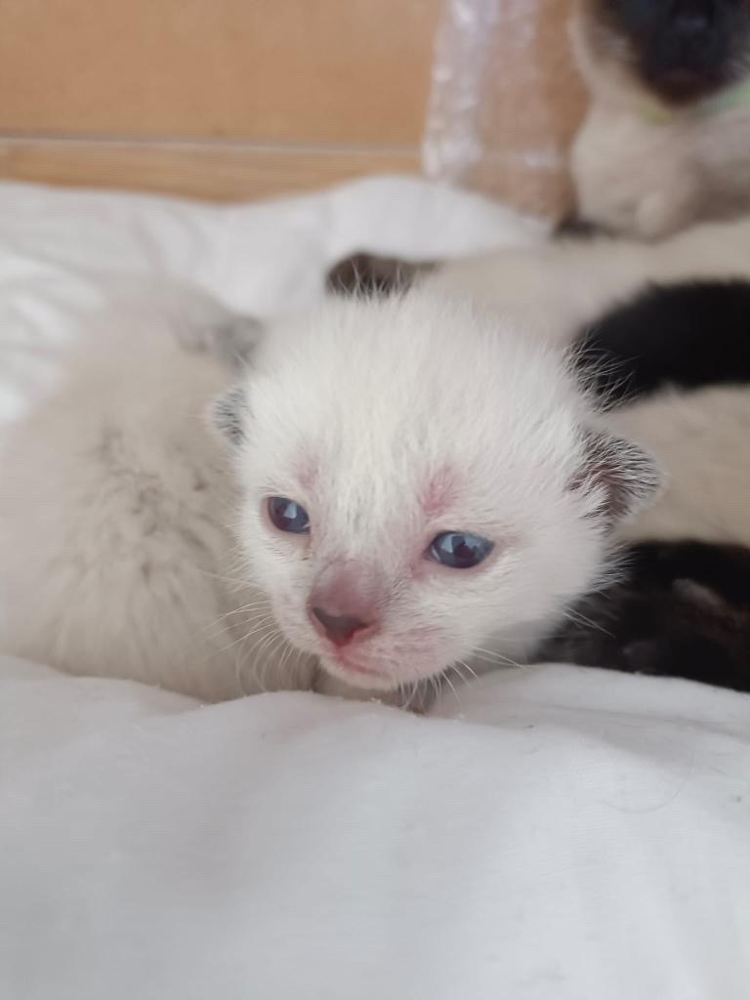
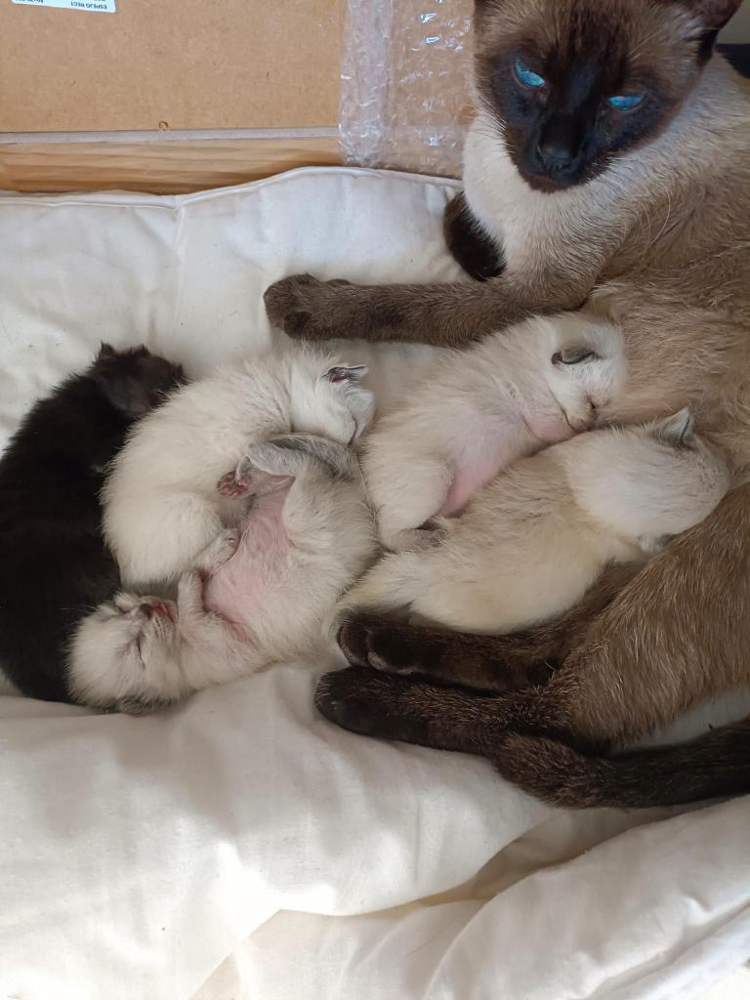
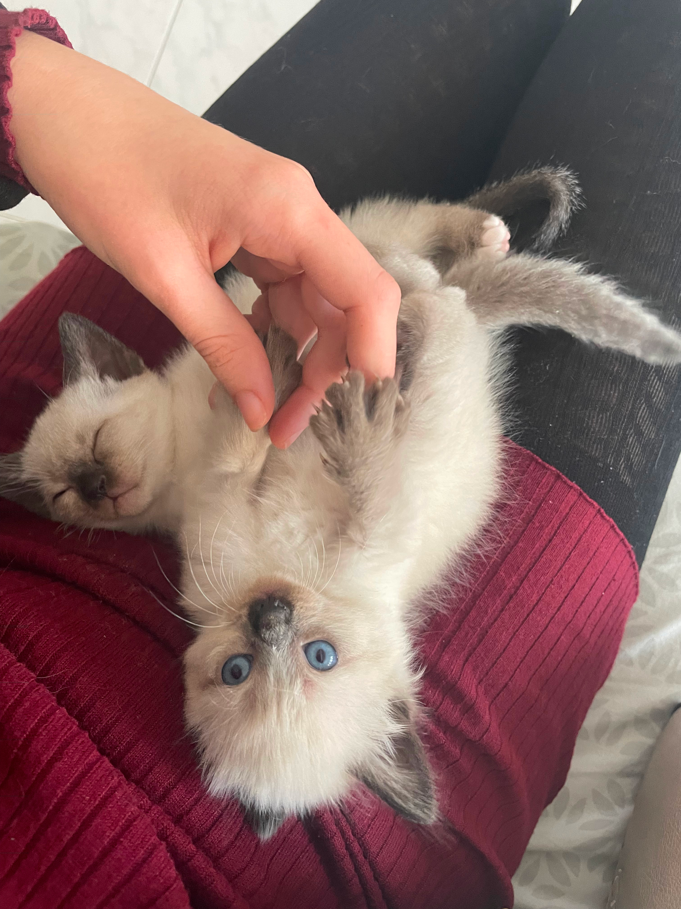
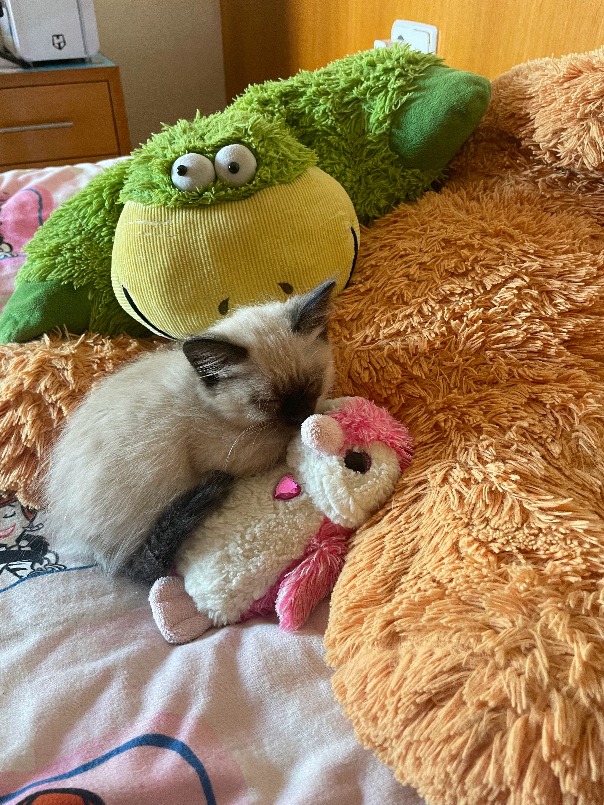
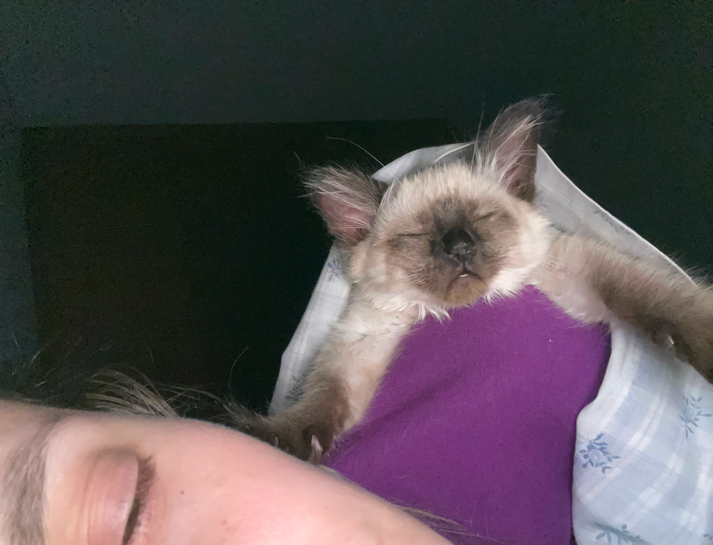
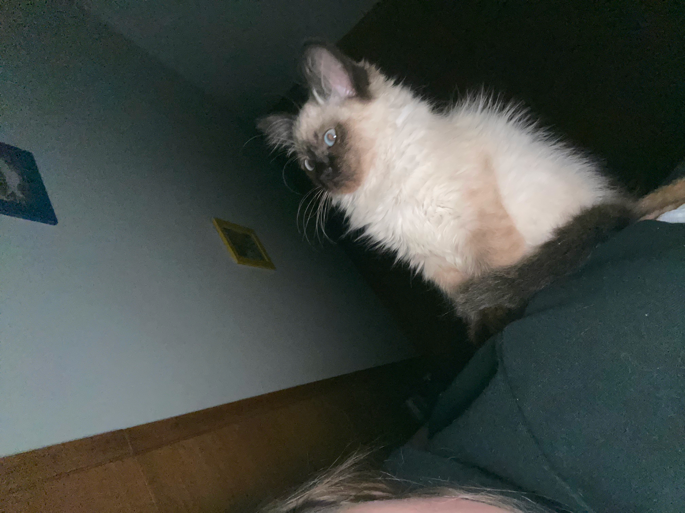
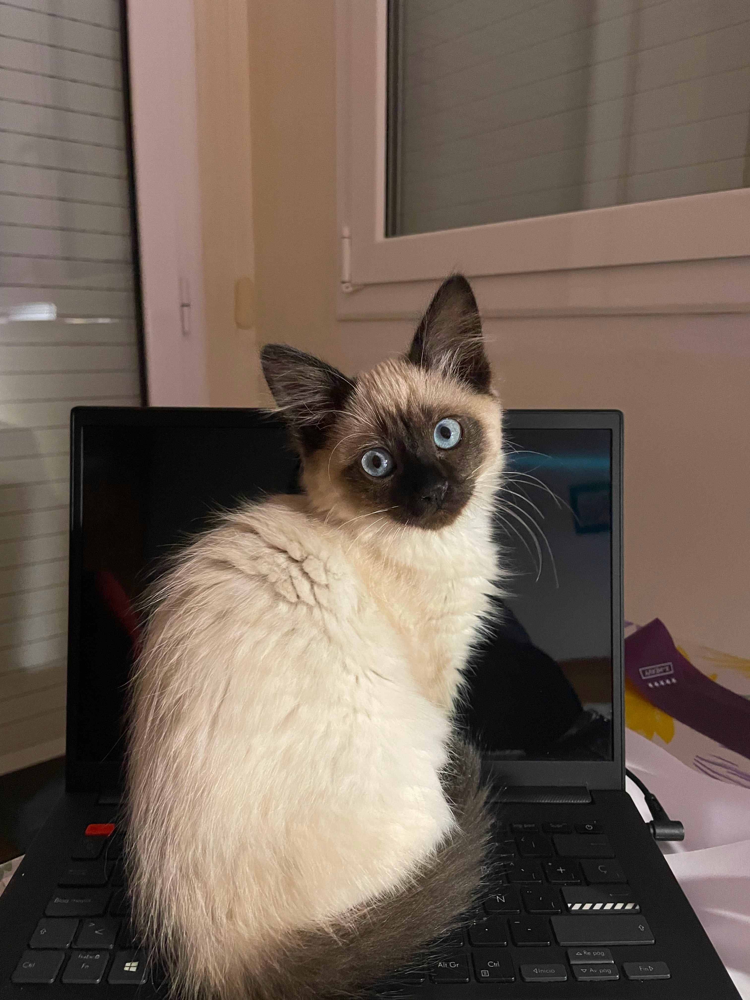
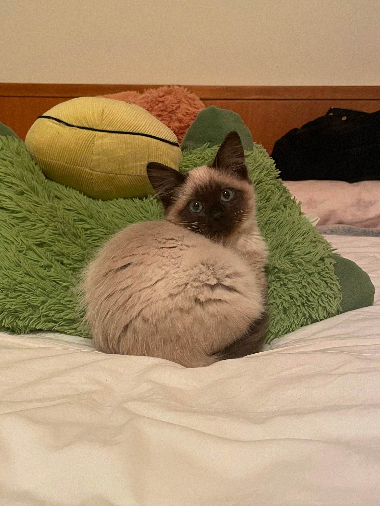
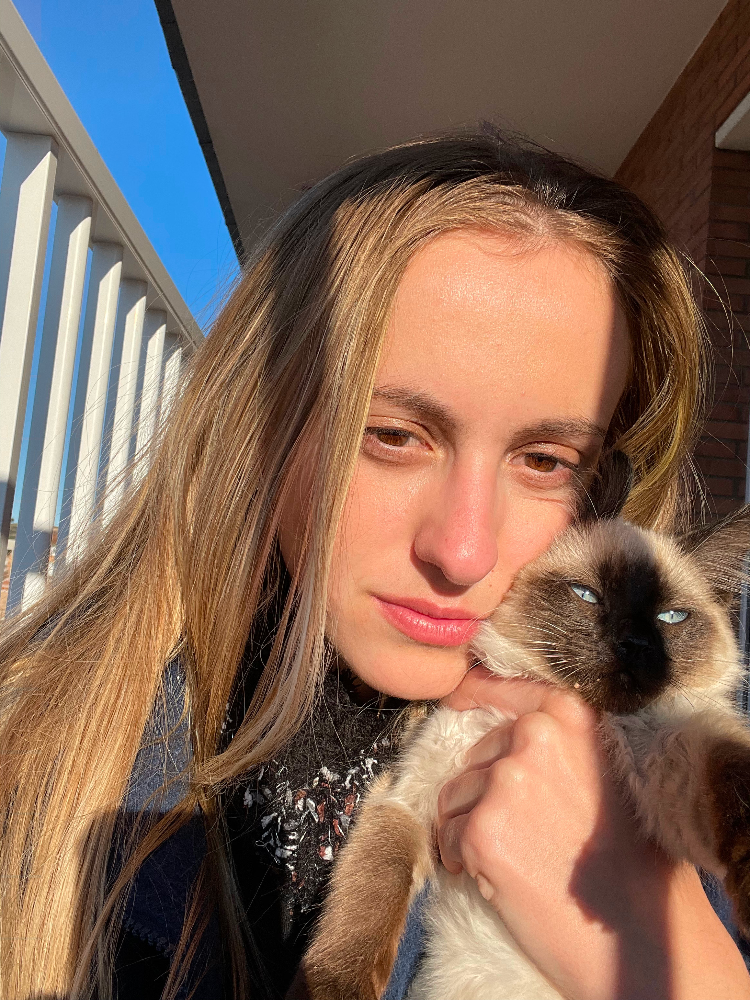
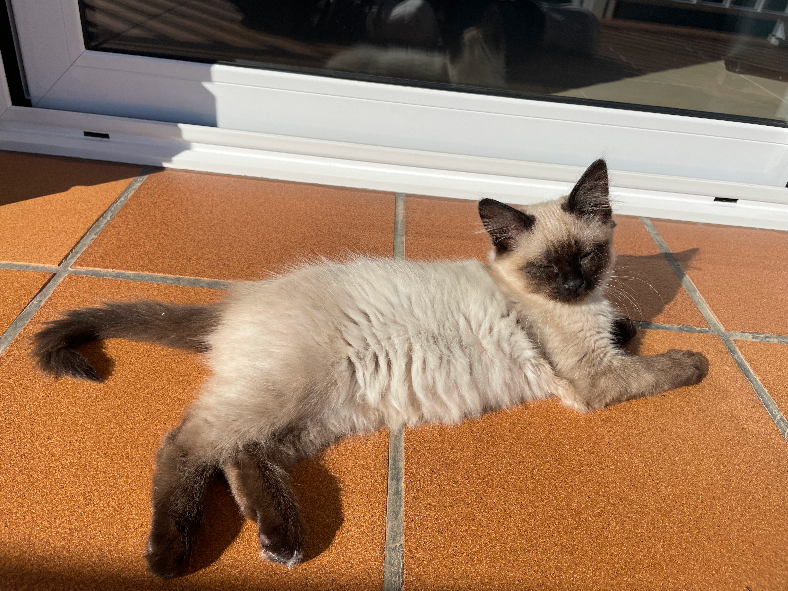

Hi, my name is Joia (Jewel in Catalan). Glamorous, right? However, I go by "Joia" only in public because Laura would be too embarrassed if someone knew of all the corny names she calls me by when we are alone. "Cheta" and "Fresita" are her favorites.

I was born on October 22nd 2022, after my abandoned mum was rescued. A total of five newborn kittens. All siamese except my brother, who spent too much time in the making. We were so adorable that everybody wanted to meet us. Laura was the first to come. I applied my technique of falling asleep on her lap, and she immediately fell in love with me. Mission passed!

Once I was two months old, I moved to Laura's house, where I've been living my best life eating yummy food, chasing birds, and taking long siestas like a good Spanish cat. I guess I am some sort of marquise. The images speak for themselves:

  
  &nbsp; &nbsp; &nbsp; &nbsp;
   

  
  &nbsp; &nbsp; &nbsp; &nbsp;
   

  
  &nbsp; &nbsp; &nbsp; &nbsp;
   

  
  &nbsp; &nbsp; &nbsp; &nbsp;
   

  
  &nbsp; &nbsp; &nbsp; &nbsp;
   

  
  &nbsp; &nbsp; &nbsp; &nbsp;
   

