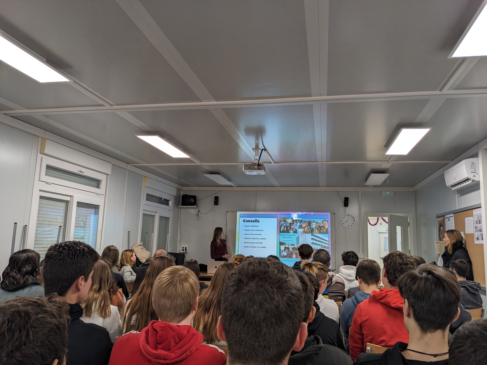

A nostalgic visit to my former high school as the year comes to an end!

I took the opportunity to share my personal journey with the last-year students of the Institut Pla de l'Estany, reflecting on what brought me to study Computer Engineering and embark on a career path as a Data Engineer at Edpuzzle. With the aim of igniting the curiosity that led me to study engineering, we played a trivia to learn more about computers, and I spoke about the challenges, growth, and exciting possibilities that await them as they pursue their own interests. It was also cool to hear they had used Edpuzzle before!

As Jean-Paul Sartre said, "Happiness is not doing what you want but wanting what you do."

You can find the slides (CAT) [here](https://lauragalera.github.io/files/I_also_want_to_be_an_engineer.pdf).

<table>
  <tr>
    <td class="image-cell">
      

          
      

    </td>
    <td class="image-cell">
      

          
      

    </td>
  </tr>
  <tr>
<table>
